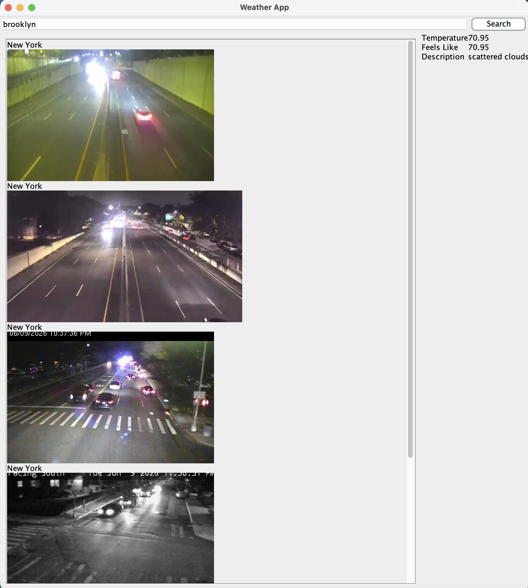

### Weather App

A Java weather application that allows the user to enter a location and view current weather 
information along with nearby webcam images. The app uses OpenWeatherMap for geocoding and 
weather data and Windy for webcam images.

### Screenshots

#### Links

- [OpenWeatherMap](https://openweathermap.org/)
- [Windy Webcams API](https://api.windy.com/webcams)
- [GitHub Repository](https://github.com/JoelleBensadon/bensadon-weather-cam)